# 识字学习应用技术文档

> 文档基于当前仓库代码实现整理，适用于开发、测试、运维与后续维护。  
> 代码基线：Web 单页应用 + Capacitor Android 打包。  
> 当前关键入口：`index.html`、`styles/app.css`、`js/app/bootstrap.js`、`js/app/main.js`、`js/app/app.js`、`build.py`。

---

## 1. 系统概述

### 1.1 软件定位

本系统是一个面向识字训练的学习应用，Web 为主运行时，Android 通过 `build.py` + Capacitor 打包为 APK。系统围绕“学字、听字、看字、写字、纠错、录音、缓存、进度管理”构建完整闭环。

### 1.2 核心功能

系统当前已实现的核心能力包括：

1. 按等级、单元管理课程内容
2. 主页单卡识字学习
3. 听音识字练习
4. 看字识音练习
5. 笔顺演示与书写练习
6. 音频播放、录音、上传、缓存
7. 学习进度查询
8. 错题集管理、复习、专项练习
9. 批量录音与批量播放
10. 登录、用户数据同步、Android 打包发布

### 1.3 技术架构

当前实现属于“静态资源 + 浏览器运行时 + 云端数据服务 + Android 壳”的轻量架构。

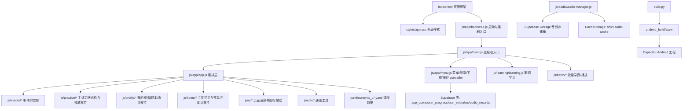

### 1.4 运行时组成

#### 前端运行时

- `index.html`
  页面骨架、工具栏、底部导航、学习视图、批量页面与所有弹窗容器。
- `styles/app.css`
  原 `index.html` 内联样式已抽离到独立样式文件，承载全局布局与组件样式。
- `js/app/bootstrap.js`
  负责强制刷新 URL 映射、`modulepreload` 注入、`config.js` / `audio-manager.js` / `main.js` 启动顺序。
- `js/app/main.js`
  主启动入口，负责恢复位置、初始化 controller、初始化课程与注册主事件。
- `js/app/app.js`
  当前已收敛为“编排层”，负责组装各类 support / engine / events 模块，并导出少量核心入口。
- `js/app/state.js`
  全局共享状态中心。
- `js/ui/ui.js`
  主页面和练习页面渲染入口。
- `js/app/menu.js`
  登录、下载、清缓存、刷新与弹窗控制器。
- `js/audio/audio-manager.js`
  Supabase 音频播放、录音上传、缓存与内置音频映射预热。

#### 当前目录分层

| 目录 | 职责 | 代表文件 |
| --- | --- | --- |
| `js/app/` | 启动入口、全局状态、主编排、菜单与基础配置 | `main.js` `app.js` `state.js` `menu.js` |
| `js/audio/` | 音频播放、缓存与资源访问 | `audio-manager.js` `audio-cache-shared.js` |
| `js/events/` | DOM 事件绑定层 | `navigation-events.js` `practice-interaction-events.js` |
| `js/practice/` | 主练习状态、判题、播放辅助 | `practice-engine.js` `practice-state-support.js` |
| `js/profile/` | 我的页、错题本、查询、分组与本地缓存辅助 | `notebook-engine.js` `profile-data-support.js` `profile-cache-support.js` |
| `js/home/` | 主页学习卡片与整单元朗读 | `home-support.js` `learn-batch-support.js` |
| `js/batch/` | 批量录音/播放页面逻辑 | `batch-record.js` `batch-play.js` |
| `js/ui/` | 页面渲染与图标辅助 | `ui.js` `ui-icon-support.js` |
| `js/utils/` | 通用工具 | `toast.js` `mistake-utils.js` |

#### 当前目录树（简化）

```text
index.html
styles/
  app.css
js/
  app/
    bootstrap.js
    main.js
    app.js
    state.js
    constants.js
    position.js
    level-data-loader.js
    menu.js
    config.js
    platform-detector.js
    refresh-context.js
    unit-number.js
  audio/
    audio-manager.js
    audio-cache-shared.js
  batch/
    batch-record.js
    batch-play.js
    batch-shared.js
  events/
    audio-interaction-events.js
    completion-modal-events.js
    home-section-events.js
    navigation-events.js
    practice-interaction-events.js
    profile-notebook-events.js
  home/
    home-support.js
    learn-batch-support.js
  learning/
    learning.js
  practice/
    practice-engine.js
    practice-state-support.js
    practice-playback-support.js
  profile/
    notebook-engine.js
    notebook-support.js
    notebook-grouping.js
    profile-data-support.js
    profile-cache-support.js
  ui/
    ui.js
    ui-icon-support.js
  utils/
    toast.js
    mistake-utils.js
  js-yaml.min.js
```

#### 数据与资源层

- `yaml/`
  课程字词句内容源。
- `shizi-audio-cache/`
  内置音频源目录，构建时复制到 Android 包内。
- Supabase Storage
  云端音频资源。
- Supabase 数据表
  用户、进度、错题、音频记录。

#### Android 打包层

- `build.py`
  初始化 Capacitor、同步资源、生成内置音频清单、构建 APK、同步 Android 元数据。

### 1.5 外部依赖

| 依赖 | 作用 |
| --- | --- |
| `@supabase/supabase-js` | 云端数据库与对象存储 |
| `hanzi-writer` | 笔顺演示与书写测验 |
| `pinyin-pro` | 汉字拼音路径生成 |
| `js-yaml` | YAML 课程文件解析 |
| `blueimp-md5` | 词/句音频文件名散列 |
| `Capacitor` | Android 壳打包 |
| `CacheStorage` | 浏览器/Android WebView 音频缓存 |
| `MediaRecorder` | 浏览器录音 |

### 1.6 重构后的目标模块图

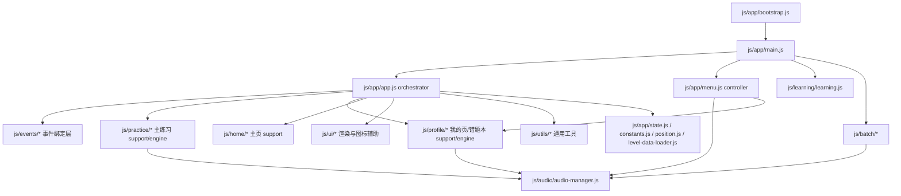

---

## 2. 页面结构说明

### 2.1 页面层级总览

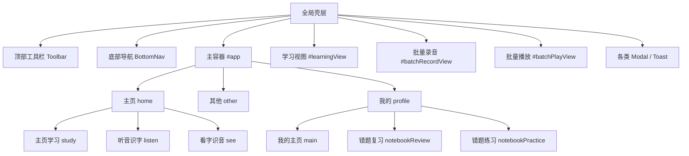

### 2.2 全局壳层

#### 顶部工具栏

- 动态标题：主页、其他、我的、听音识字、看字识音、笔顺学习、复习、练习。
- 左侧区域：标题、条件显示搜索框。
- 右侧区域：
  - 主页学习态 / 主练习态：等级选择器 + 单元导航
  - 复习/练习态：组切换导航
- 视觉规则：
  - 主页学习页、听音识字页、看字识音页的单元切换组件，已统一为与复习页组切换一致的导航样式。

搜索结果页规则：

- 搜索命中后，主容器显示 `等级 - 单元` 标题与结果卡片。
- 搜索结果卡片会在标题下方保留额外垂直间距，避免卡片内容遮挡标题文字。

#### 底部导航

- `主页`
- `其他`
- `我的`

特殊规则：

- 笔顺学习页中，底部 `主页` 会变成 `回到主页`。
- 主练习页（听音识字 / 看字识音）中，底部仍显示 `主页`，但不高亮。
- 主练习页的返回操作由标题左侧的 `返回` 按钮承担。

### 2.3 页面清单与定位

| 页面 | 状态标识 | 定位 | 主要功能 | 上下游关系 |
| --- | --- | --- | --- | --- |
| 主页-学习 | `appSection=home` + `mainViewMode=study` | 核心学习入口 | 识字卡片、单元字切换、字词句播放 | 可进入笔顺学习、听音识字、看字识音 |
| 主页-听音识字 | `appSection=home` + `mainViewMode=listen` | 主练习页 | 播放题干、选字、统计结果、标题左侧返回 | 错误写入错题表；返回进入前页面 |
| 主页-看字识音 | `appSection=home` + `mainViewMode=see` | 主练习页 | 看字选音、误选揭示、统计结果、标题左侧返回 | 错误写入错题表；返回进入前页面 |
| 其他页 | `appSection=other` | 功能入口页 | 听音识字、看字识音、下载、清缓存、教学模式、刷新 | 导航到主页练习或批量功能 |
| 我的主页 | `appSection=profile` + `profileView=main` | 用户数据中心 | 登录信息、学习进度、录音进度、错题集 | 可进入复习页与错题练习页 |
| 错题复习 | `profileView=notebookReview` | 错题回顾 | 卡片复习、误认字播放、组内切换 | 返回我的主页 |
| 错题练习 | `profileView=notebookPractice` | 错题专项训练 | 听音/看字错题练习、统计、重新练、下一组、标题左侧返回 | 返回我的主页 |
| 笔顺学习 | `learningView.active` | 深度单字学习 | 笔顺演示、书写测验、完成保存进度 | 从主页学习卡片进入 |
| 批量录音 | `batchRecordView.active` | 教学录音辅助页 | 批量录音、预览、上传、切换项目/单元 | 从主页进入 |
| 批量播放 | `batchPlayView.active` | 教学播放辅助页 | 单个播放、顺序播放、切换项目/单元 | 从主页进入 |

### 2.4 页面布局示意图

#### 主页学习布局

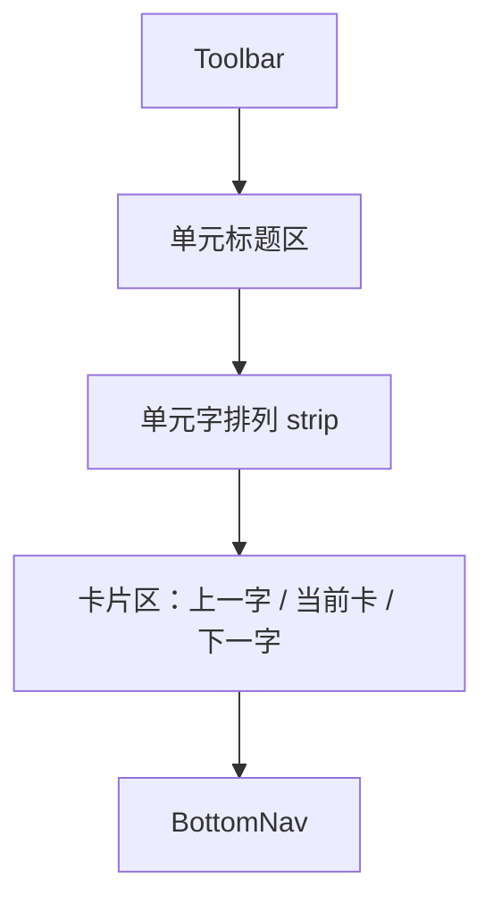

#### 其他页布局

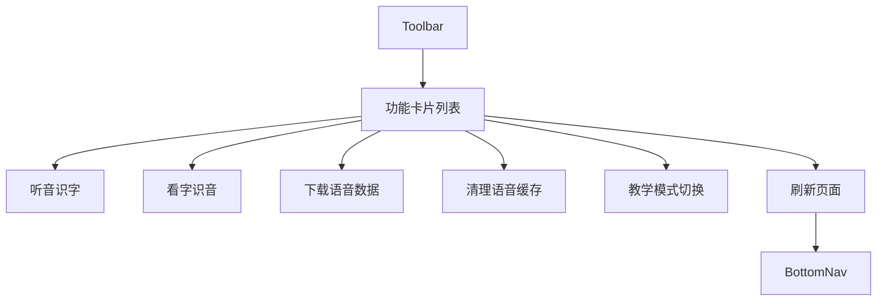

#### 我的主页布局

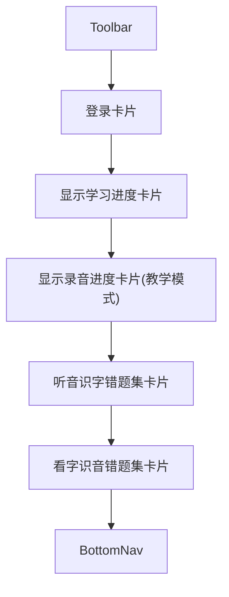

#### 主练习布局（主页听音 / 主页看字）

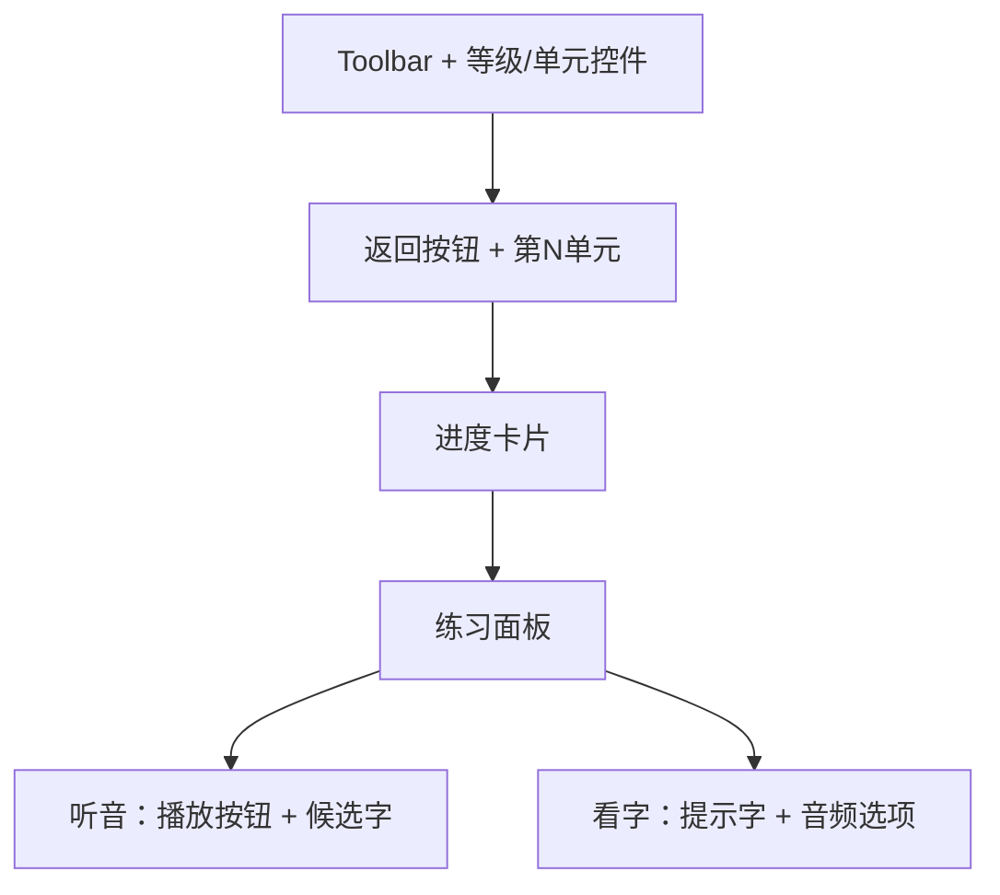

#### 错题复习布局

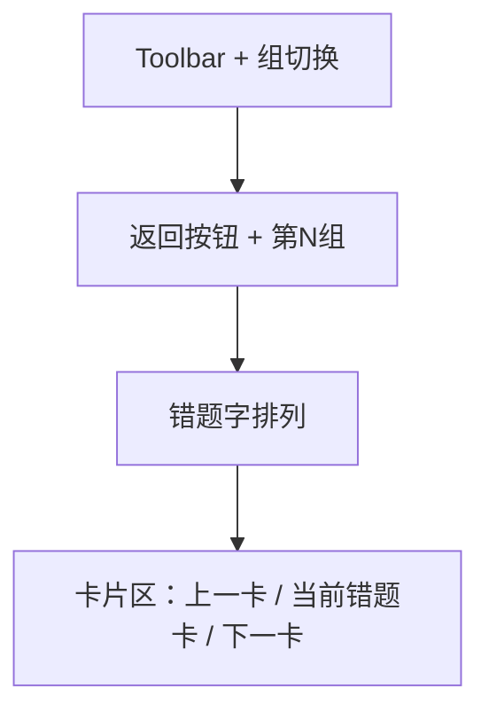

#### 错题练习布局

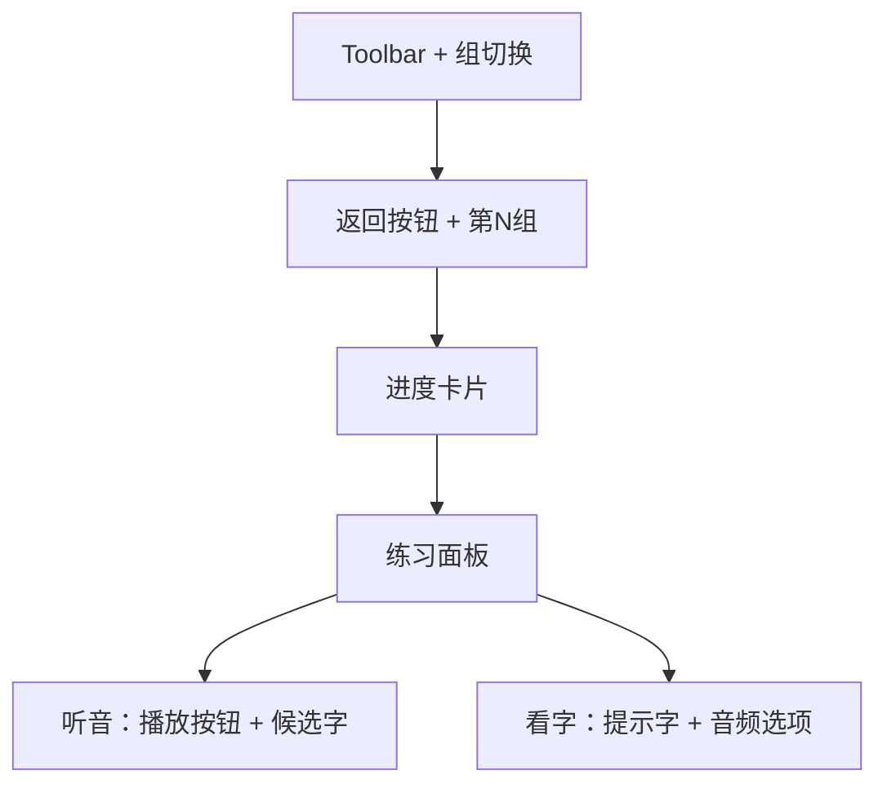

#### 笔顺学习布局

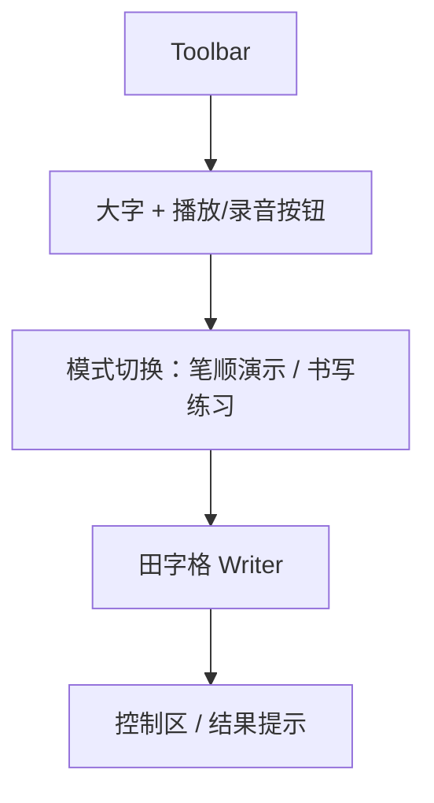

---

## 3. 功能模块详解

### 3.1 主页模块

#### 单元切换模块

- 功能
  在当前等级下切换单元。
- 交互
  顶部上一单元、下一单元、下拉选择器。
- 键盘规则
  在主页学习页中，左右键优先用于当前单元内卡片切换；只有离开主页学习页后，左右键才回退到各页面自己的导航逻辑。
- 数据依赖
  `state.currentLevel`、`state.unitKeys`、`state.currentUnitIndex`。

#### 单字卡片模块

- 功能
  展示字、词、句、播放按钮。
- 交互
  左右卡片按钮、键盘方向键、触摸滑动、点击单元字排列定位。
  学习模式与教学模式下均支持单元内卡片导航。
- 数据依赖
  `state.currentData[unitName]`、`state.homeCardIndex`、`state.homeCardMotion`。

#### 整单元朗读模块

- 功能
  按当前单元字、词、句顺序连续朗读，并在朗读过程中自动切换主页卡片与高亮当前朗读内容。
- 交互
  点击单元标题右侧朗读按钮开始；再次点击可暂停；播放完毕或手动停止后恢复为喇叭按钮。
- 状态规则
  朗读按钮一旦进入播放态，在自动切换到下一卡片时仍保持暂停图标与高亮状态，直到：
  - 单元朗读完毕
  - 用户手动停止

#### 主页听音识字模块

- 功能
  听音后从候选字中选择正确字，使用主练习骨架渲染。
- 交互
  点击喇叭、点击候选字、点击标题左侧 `返回`。
- 输出
  更新 `listenMode.questions`、`answeredChars`、`mistakeChars`，必要时写入错题表。
  返回时依据 `practiceEntryContext` 回到进入前页面。

#### 主页看字识音模块

- 功能
  根据提示字选择对应读音，使用主练习骨架渲染。
- 交互
  点击音频按钮、拖拽/点击、点击标题左侧 `返回`。
- 输出
  更新 `seeMode.questions`、`revealedOptions`、`mistakeChars`，必要时写入错题表。

### 3.2 其他页模块

#### 功能入口卡片

- `听音识字`
- `看字识音`
- `下载语音数据`
- `清理语音缓存`
- `切换教学/学习模式`
- `刷新页面`

#### 依赖关系

- 通过 `data-action` 由 `app.js` 事件代理统一处理。
- 部分功能跳转到主页练习页，部分调用 `menu.js` 菜单逻辑。

### 3.3 我的主页模块

#### 登录卡片

- 功能
  显示当前账号状态，触发登录/注销。
- 依赖
  `localStorage[USER_KEY]`、`menu.js` 登录流程。

#### 学习进度卡片

- 功能
  展示已缓存的学习进度，并按等级/单元分组。
- 交互
  顶层卡片展开，等级行展开，内容行跳转复习。
- 数据依赖
  `state.profileProgress.*`

#### 录音进度卡片

- 功能
  在教学模式下展示已录音汉字进度，并按等级/单元分组。
- 交互
  顶层卡片展开，等级行展开，内容行右侧显示 `查看` 按钮。
  点击 `查看` 后直接跳转到对应等级和单元，不再弹出统计弹窗。
- 数据依赖
  `state.audioProgress.*`

#### 错题集卡片

- 功能
  展示听音识字与看字识音错题。
- 交互
  顶层卡片展开，等级展开，组行操作 `复习 / 练习`。
- 数据依赖
  `state.notebook.*`

### 3.4 错题复习模块

#### 组切换模块

- 功能
  在当前等级下切换错题组。
- 交互
  顶部工具栏左右导航。
- 依赖
  `state.notebook.reviewLevel`、`reviewGroupIndex`。

#### 复习卡片模块

- 功能
  展示当前错题主字及“误认为”列表。
- 交互
  点击错题字排列切换卡片，误认字右侧喇叭播放对应录音。
- 依赖
  `wrong_chars` 的结构化上下文 `{ char, level, unit }`。

### 3.5 错题练习模块

当前版本中，主练习页与错题练习页已抽象出共用骨架，统一包含：

- 左侧返回按钮
- 标题区（单元 / 组）
- 进度卡片
- 题目区
- 作答区

差异通过数据源、标题、返回动作和数据库交互规则区分。

#### 错题听音练习

- 功能
  以错题集为训练源重做听音识字，复用听音练习骨架。
- 规则
  题目来源为：
  - 原错字
  - 误认字列表

#### 错题看字练习

- 功能
  以错题集为训练源重做看字识音，复用看字练习骨架。
- 规则
  同样使用原错字与误认字列表生成题目集合。

#### 完成统计弹窗

- 功能
  展示本组正确/错误统计。
- 按钮
  - `重新练`
  - `下一组`
- 显示规则
  仅当 `wrongSelections` 中存在误认字时显示 `重新练`。

#### 重新练模块

- 功能
  仅重练本次未首次做对的字及其误认字列表。
- 规则
  重新练模式下 `allowRemoval=false`，即：
  - 允许新增错误数据
  - 不执行自动删除错题记录

### 3.6 笔顺学习模块

#### 演示模式

- 功能
  笔顺演示、逐笔动画。
- 依赖
  HanziWriter。

#### 书写练习模式

- 功能
  跟随笔顺书写，记录错误次数。
- 输出
  若登录，完成后把当前字写入 `user_progress`。

### 3.7 批量录音模块

- 功能
  顺序录制字、词、句音频。
- 交互
  录音、上传、上下切换项目、左右切换单元。
- 技术点
  `MediaRecorder` 录音，`audioManager.uploadAudio()` 上传。

### 3.8 批量播放模块

- 功能
  顺序播放字、词、句音频。
- 交互
  单个播放、顺序播放、上下切换项目、左右切换单元。
- 技术点
  复用 `audioManager.playAudio()`。

### 3.9 菜单与弹窗模块

包含以下弹窗：

- 登录弹窗
- 登录加载弹窗
- 密码弹窗
- 等级选择弹窗
- 批次大小弹窗
- 进度查询弹窗
- 确认弹窗
- 缓存清理进度弹窗
- 通用任务进度弹窗
- 听音/看字完成统计弹窗

---

## 4. 功能实现逻辑

### 4.1 启动流程

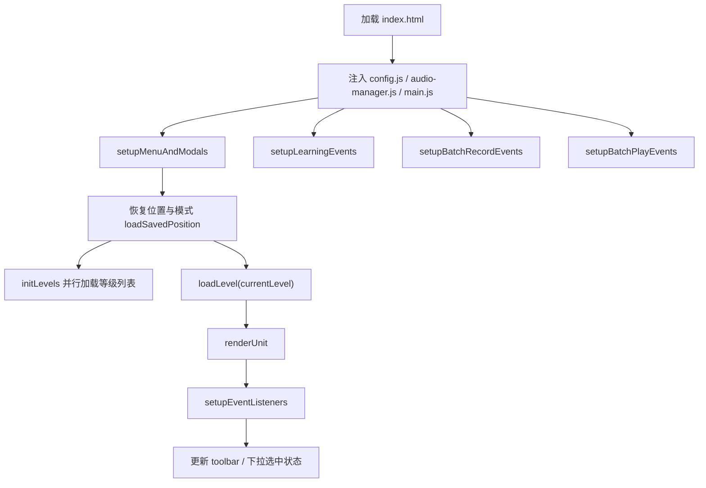

### 4.2 页面渲染主流程

`renderUnit()` 是 UI 汇总入口：

1. 根据 `state.appSection` 判断当前一级页面
2. 根据 `state.mainViewMode` 或 `state.profileView` 进一步确定子页面
3. 调用具体渲染函数：
   - `renderHomeStudyMode`
   - `renderListenMode`
   - `renderSeeMode`
   - `renderOtherSection`
   - `renderProfileSection`
4. 更新顶部工具栏与底部导航

伪代码：

```text
if no currentData:
    render loading
else if appSection == other:
    renderOtherSection()
else if appSection == profile:
    renderProfileSection()
else if mainViewMode == listen:
    renderListenMode()
else if mainViewMode == see:
    renderSeeMode()
else:
    renderHomeStudyMode()
```

说明：

- `renderListenMode()` 与 `renderNotebookPracticeSection(mode=listen)` 共用练习页骨架。
- `renderSeeMode()` 与 `renderNotebookPracticeSection(mode=see)` 共用练习页骨架。
- 主练习页通过 `practiceEntryContext` 控制返回前页面。
- `renderSearchResult()` 使用独立搜索结果布局，标题与结果卡片之间保留安全间距，避免视觉重叠。
- “显示学习进度 / 显示录音进度 / 错题集”三类顶层卡片共用同一套分组折叠卡片壳，差异通过图标、标题、数量、内容区与行动按钮配置控制。
- 主页学习页的学习模式与教学模式共用同一套卡片浏览逻辑；教学模式不再屏蔽单元字点击跳卡、左右键切卡与滑动切卡。

### 4.3 听音识字实现逻辑

#### 主练习

1. 初始化题集：
   - 从当前单元抽取字列表
   - `buildListenOptions(correctChar)` 从当前等级字池中生成 1 正确 + 3 干扰项
2. 用户选择：
   - 若首次答对，`countedCorrect = true`
   - 若先答错后再答对，`countedCorrect = false`
3. 若答错：
   - 记录 `wrongSelections`
   - 标记 `hadMistake=true`
   - 写入 `user_mistakes`
4. 做完整单元后：
   - 弹统计弹窗
   - 可重新听错字集合

#### 错题练习

1. 从 `state.notebook.items` 中按等级、组取出错题源
2. 生成题集：
   - 主字 `item.char`
   - 误认字 `item.wrong_chars`
3. 完成后弹本组统计
4. 若存在误认字，可 `重新练`

### 4.4 看字识音实现逻辑

与听音识字的结构一致，但在表现层有两个差异：

1. 提示区显示正确字
2. 错误选项会被揭示：
   - `question.revealedOptions.push(selectedChar)`

### 4.5 错题记录实现逻辑

#### 错误写入

`updateUserMistakeRecord(...)` 负责：

1. 按唯一键查现有记录
2. 合并 `wrong_chars`
3. `mistake_count + 1`
4. `upsert` 到 `user_mistakes`

#### 误认字标准化

当前实现把 `wrong_chars` 标准化为：

```json
[
  {
    "char": "远",
    "level": "L0",
    "unit": "第一单元"
  }
]
```

目的：

- 复习页误认字播放时使用误认字自己的上下文
- 练习页误认字重练时能带上真实 `level + unit`
- 兼容历史字符串数组并在读取阶段自动升级

#### 错题练习数据规则

当前代码中的错题练习数据规则为：

1. 普通进入错题练习：
   - 首次做对，可触发删除
2. 从统计弹窗点击 `重新练` 后：
   - 只新增错误数据
   - 不执行删除
3. “重新练”内容只包含本次 `countedCorrect=false` 的题及其误认字

### 4.6 进度查询实现逻辑

#### 学习进度

- 数据源：`user_progress`
- 按 `level -> unit -> chars` 分组
- 顶层卡片支持折叠
- 每个等级下内容区域为固定可视高度 + 隐藏滚动条
- 行按钮支持跳转到对应单元学习页

#### 我的页加载

`loadProfilePageData(force, { showQueryToasts })` 同时并发：

- `loadNotebookData()`
- `loadProfileProgressData()`
- 教学模式下追加：`loadAudioProgressData()`

并通过：

- `正在查询数据中...`
- `查询完毕！`

形成串联式 toast 反馈。

当前查询策略已收敛为：

1. 登录成功后：
   - 远程统一查询
   - 查询学习进度、错题集
   - 教学模式下额外查询录音进度
   - 显示 toast
2. 应用启动时（已登录）：
   - 远程统一查询
   - 查询学习进度、错题集
   - 教学模式下额外查询录音进度
   - 静默执行，不显示 toast
3. 点击“其他”页 `刷新页面` 卡片：
   - 在页面强刷前先执行一次静默统一查询
   - 教学模式下包含录音进度查询
4. 点击底部导航进入“我的”页：
   - 不执行远程查询
   - 直接展示当前缓存
5. 从错题复习页 / 错题练习页返回“我的”主页：
   - 不执行远程查询
   - 直接展示当前缓存

### 4.7 批量录音与批量播放实现逻辑

#### 批量录音

1. 构建当前单元字/词/句条目列表
2. 选择条目后录音
3. 本地可回放新录音
4. 上传到 Supabase Storage
5. 记录同步写入 `audio_records`

#### 批量播放

1. 构建当前单元条目列表
2. 支持单个播放
3. 支持顺序播放
4. 顺序播放中自动切换当前高亮条目

### 4.8 Android 构建实现逻辑

`build.py` 负责：

1. 初始化 Capacitor Android 工程
2. 同步 `index.html`、`js/`、`yaml/`
3. 打包 `shizi-audio-cache/` 为 `www/audio`
4. 生成 `audio-manifest.json`
5. 同步 Android 元数据：
   - 应用名
   - 包名
   - 版本号
   - 图标
   - 状态栏颜色
   - 录音权限
6. 调用 Gradle 构建 APK

---

## 5. 数据操作逻辑

### 5.1 数据播放功能

#### 播放控制流程

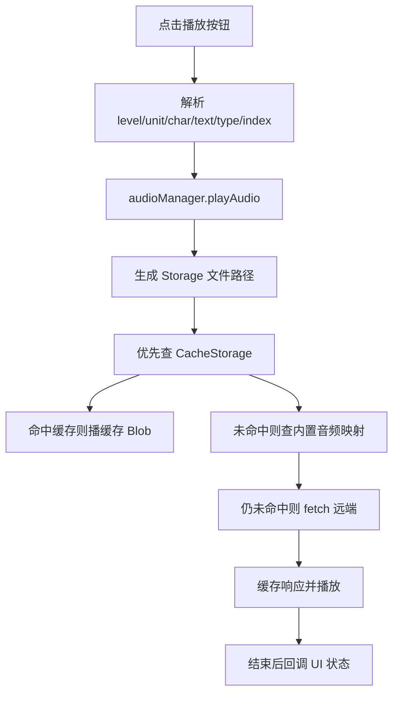

#### 格式支持

- `char.mp3`
- `word_*.mp3`
- `sentence.mp3`

#### 进度管理

- 单个播放：按钮进入 `playing` 状态
- 听音识字：有独立进度卡片
- 顺序播放：有条目级进度与当前项高亮
- 整单元朗读：主页朗读按钮在跨卡片渲染期间保持 `playing` 状态，不因 `renderUnit()` 重绘而恢复默认图标

#### 异常处理

- 找不到音频：提示 `暂无录音`
- 播放失败：提示 `播放失败`
- 播放前会先停止当前音频，避免重叠

### 5.2 数据暂停功能

#### 暂停状态保存

- 当前音频由 `audioManager.currentAudio` 管理
- 循环朗读由 `state.isLoopingAudio` 或 `learnBatchPlayback.paused` 管理

#### 恢复机制

- 单字循环朗读：按钮再次点击会恢复下一轮播放
- 整单元朗读：`toggleLearnBatchPlayback` 支持暂停/继续
- 整单元朗读切到下一卡片时：
  会同步新生成的朗读按钮状态，继续显示暂停图标与高亮

#### 资源释放

- `audioManager.stopCurrentAudio()`
- 释放上一个 `blob:` URL
- 清理 `onStopCallback`

### 5.3 数据上传功能

#### 上传流程

1. `MediaRecorder` 采集音频
2. `stopRecording()` 生成 `Blob`
3. `audioManager.uploadAudio(blob, level, unit, char, text, type, index)`
4. 写入 Supabase Storage
5. `audio_records` 表 `upsert`

#### 文件校验规则

- 若未传 `type`，按 `text/char` 推断
- 录音停止后若 `Blob` 为空则视为失败

#### 断点续传

- 当前实现：**未实现**
- 现状为单次完整上传，失败后需重新上传

#### 进度显示

- 批量录音页面右侧显示条目进度
- 上传时显示 `uploadingModal`

#### 错误处理

- 录音启动失败
- 上传失败
- 预览播放失败
- 数据库写入错误

### 5.4 数据下载功能

#### 触发机制

1. 从菜单点击 `下载语音数据`
2. 选择等级
3. 输入批次大小
4. 开始批量下载

#### 文件分批策略

- 按 `batchSize` 分批并发下载
- 每批完成后更新进度条

#### 进度跟踪

- 使用 `taskProgressModal`
- 动态显示：
  - 百分比
  - 已下载数 / 总数

#### 本地存储位置

- Web/浏览器：`CacheStorage` 下的 `shizi-audio-cache`
- Android 包内内置资源：`android_build/www/audio`

### 5.5 数据修改功能

#### 学习进度修改

- 写入表：`user_progress`
- 方式：`upsert`
- 唯一维度：`username + char + level + unit`
- 写库成功后：
  通过 `profile-cache-support.js` 直接增量更新 `state.profileProgress`

#### 错题数据修改

- 写入表：`user_mistakes`
- 方式：
  - `upsert` 错误记录
  - `delete` 删除主错题
  - `update wrong_chars` 删除单个误认字项
- 写库成功后：
  通过 `profile-cache-support.js` 直接增量更新 `state.notebook.items`

#### 权限控制

- 写用户数据前要求已登录
- 云端数据库连接失败时跳过写入并提示

#### 版本管理

- 当前实现：**未实现业务版本管理**
- 现状为“最后写入覆盖 + 幂等 upsert”

#### 数据同步机制

- 登录后立即远程统一查询“我的”页数据
- 应用启动时若已登录，会静默统一查询“我的”页数据
- 教学模式下统一查询会额外包含录音进度
- 页面跳转不再默认触发远程查询，优先展示内存缓存
- 错题练习中使用 mutation 队列等待数据库变更落库后再刷新页面
- 本地缓存只在“写库成功后”执行增量同步

---

## 6. 接口说明

### 6.1 内部模块接口

#### `js/app/main.js`

| 接口 | 说明 |
| --- | --- |
| 启动顺序 | 初始化菜单、学习事件、批量页面、等级、课程、全局事件 |

#### `js/app/app.js`

| 接口 | 说明 |
| --- | --- |
| `switchTeachingMode(enable)` | 切换教学/学习模式 |
| `setupEventListeners()` | 装配并注册主事件模块 |
| `clearProfilePageDataAfterLogout()` | 注销后清空我的页数据 |
| `navigateToUnit(level, unitName)` | 跳转到指定等级和单元 |

#### `js/ui/ui.js`

| 接口 | 说明 |
| --- | --- |
| `renderUnit()` | 主页面统一渲染入口 |
| `updateAppShell()` | 同步 toolbar / bottom nav |
| `applyResponsiveLayout()` | 响应式布局适配 |
| `getBtnHtml(...)` | 生成标准播放/录音按钮 |

#### `js/app/menu.js`

| 接口 | 说明 |
| --- | --- |
| `setupMenuAndModals()` | 初始化菜单、登录、下载、清缓存、刷新与弹窗 |

#### `js/learning/learning.js`

| 接口 | 说明 |
| --- | --- |
| `enterLearning(char, level, unit)` | 进入笔顺学习页 |
| `exitLearning()` | 退出笔顺学习页 |
| `setupLearningEvents()` | 初始化笔顺学习事件 |

#### `js/audio/audio-manager.js`

| 接口 | 说明 |
| --- | --- |
| `startRecording()` | 开始录音 |
| `stopRecording()` | 结束录音并返回 Blob |
| `uploadAudio(...)` | 上传音频并登记 `audio_records` |
| `playAudio(...)` | 播放音频 |
| `getAllAudioRecords()` | 获取所有音频记录 |
| `warmBuiltInAudioCache()` | 预热内置音频映射 |

#### 当前核心 support / engine

| 模块 | 说明 |
| --- | --- |
| `js/practice/practice-engine.js` | 主练习判题、重试、历史导航 |
| `js/practice/practice-state-support.js` | listen / see 会话初始化与状态辅助 |
| `js/practice/practice-playback-support.js` | 主练习音频播放辅助 |
| `js/profile/notebook-engine.js` | 错题复习/错题练习主流程 |
| `js/profile/notebook-support.js` | 错题本页面辅助、错题删除、跳转、完成弹窗 |
| `js/profile/profile-data-support.js` | 我的页数据远程查询与状态同步 |
| `js/profile/profile-cache-support.js` | 学习进度 / 错题集本地缓存增量更新 |
| `state.audioProgress` | 教学模式下录音进度分组缓存与展开状态 |
| `js/home/home-support.js` | 主页学习区导航与完成弹窗 |
| `js/home/learn-batch-support.js` | 整单元朗读流程 |

### 6.2 DOM 事件接口约定

| 选择器 / 数据属性 | 含义 |
| --- | --- |
| `.section-action-card[data-action]` | 页面功能卡片点击入口 |
| `[data-profile-progress-header]` | 学习进度等级折叠头 |
| `[data-profile-progress-nav]` | 学习进度内容行跳转 |
| `[data-notebook-section]` | 错题集顶层卡片折叠 |
| `[data-notebook-level-header]` | 错题等级折叠 |
| `[data-notebook-action]` | 复习/练习/返回等动作 |
| `.play-btn` | 全局播放/录音按钮 |
| `.listen-option-btn` | 听音识字候选项 |
| `.see-audio-option` | 看字识音候选项 |

### 6.3 外部系统接口

#### Supabase 表接口

| 表名 | 用途 | 关键字段 |
| --- | --- | --- |
| `app_users` | 用户存在性检查与创建 | `username` |
| `user_progress` | 学习进度 | `username,char,level,unit,completed_at` |
| `user_mistakes` | 错题记录 | `username,char,level,unit,mistake_mode,mistake_count,wrong_chars` |
| `audio_records` | 音频索引 | `path,level,unit,char,type,created_at` |

#### Supabase Storage 接口

- 存储桶：由 `SUPABASE_CONFIG.bucket` 指定
- 文件路径约定：

```text
{level}/Unit_{unitCode}/{charPinyin}/{filename}
```

例如：

```text
L0/Unit_1/yuan/char.mp3
```

---

## 7. 异常处理

### 7.1 页面与状态异常

| 场景 | 处理策略 |
| --- | --- |
| 保存位置损坏 | `loadSavedPosition()` 捕获异常并忽略 |
| 页面切换时滚动异常 | 通过 `renderUnitPreservingScroll()` 保持滚动位置 |
| 折叠动画跳动 | 顶层卡片使用真实高度动画或原地切 class |

### 7.2 数据加载异常

| 场景 | 处理策略 |
| --- | --- |
| Supabase 未连接 | 页面显示错误状态并弹 toast |
| 学习进度查询失败 | `profileProgress.error = 学习进度加载失败` |
| 错题集查询失败 | `notebook.error = 生字本加载失败` |
| YAML 加载失败 | 输出警告，必要时回退默认等级 |

### 7.3 音频异常

| 场景 | 处理策略 |
| --- | --- |
| 音频不存在 | 提示 `暂无录音` |
| 播放失败 | 提示 `播放失败` |
| 录音失败 | 提示 `无法启动录音` 或 `上传失败` |
| 缓存失败 | 控制台警告，退回网络播放 |

### 7.4 用户操作异常

| 场景 | 处理策略 |
| --- | --- |
| 未登录查看进度 | 提示 `请先登录查看进度` |
| 批次大小非法 | 提示输入 1-100 |
| 已到最后一单元/最后一组 | 弹 info toast |
| 无需重新练 | 隐藏重试按钮或提示当前没有需要重新练的字 |

### 7.5 数据一致性风险

当前代码已做的保护：

- 错题练习中的数据库增删改使用 mutation 队列等待完成后再刷新页面
- `wrong_chars` 统一标准化，避免旧数据格式造成播放失败

当前尚未实现但建议后续补强：

1. 数据库事务级原子操作
2. 统一服务端约束与存储过程
3. 更细粒度的乐观锁或版本字段

---

## 8. 关键业务规则汇总

### 8.1 判分规则

- 首次直接答对：`countedCorrect = true`
- 先答错再答对：`countedCorrect = false`
- 统计弹窗按 `countedCorrect === true / false` 统计

### 8.2 错题规则

- 主练习答错：
  写入或追加 `user_mistakes`
- 错题练习普通模式：
  可按规则删除
- 错题练习 `重新练` 模式：
  不删除，只追加错误数据
- 错题相关本地缓存：
  只在数据库写入成功后更新 `state.notebook.items`

### 8.3 误认字规则

- `wrong_chars` 以对象数组形式保存：
  `{ char, level, unit }`
- 误认字播放时优先使用误认字自己的 `level + unit`

### 8.4 查询提示规则

- 登录成功后的统一查询：
  若显示 `正在查询数据中...`，查询完成后必须紧接 `查询完毕！`
- 应用启动时与“刷新页面”卡片触发的统一查询：
  静默执行，不显示查询 toast

---

## 9. 维护建议

1. 页面交互继续收敛到共享 helper
   避免主练习和错题练习逻辑分叉。
2. 将错题数据操作上移为统一 service 层
   便于后续引入事务和回滚。
3. 为错题练习、重新练、误认字播放补自动化回归用例
   当前该区域业务规则复杂且容易回归。
4. 为 `project.md` 建立“变更日志”段落
   每次规则调整同步更新文档。

---

## 10. 参考文件

- `index.html`
- `styles/app.css`
- `js/app/bootstrap.js`
- `js/app/main.js`
- `js/app/app.js`
- `js/app/state.js`
- `js/app/constants.js`
- `js/app/position.js`
- `js/app/level-data-loader.js`
- `js/app/menu.js`
- `js/audio/audio-manager.js`
- `js/audio/audio-cache-shared.js`
- `js/learning/learning.js`
- `js/batch/batch-record.js`
- `js/batch/batch-play.js`
- `js/batch/batch-shared.js`
- `js/practice/practice-engine.js`
- `js/practice/practice-state-support.js`
- `js/practice/practice-playback-support.js`
- `js/profile/notebook-engine.js`
- `js/profile/notebook-support.js`
- `js/profile/notebook-grouping.js`
- `js/profile/profile-data-support.js`
- `js/home/home-support.js`
- `js/home/learn-batch-support.js`
- `js/ui/ui.js`
- `js/ui/ui-icon-support.js`
- `js/utils/toast.js`
- `js/utils/mistake-utils.js`
- `sql/app_users.md`
- `sql/audio_records.md`
- `sql/user_progress.md`
- `sql/user_mistakes.md`
- `build.py`
